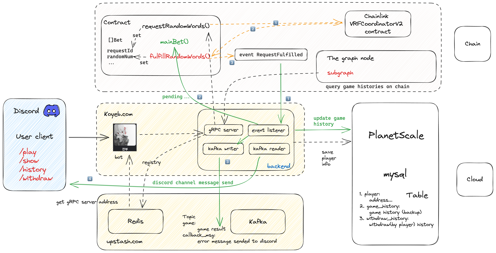
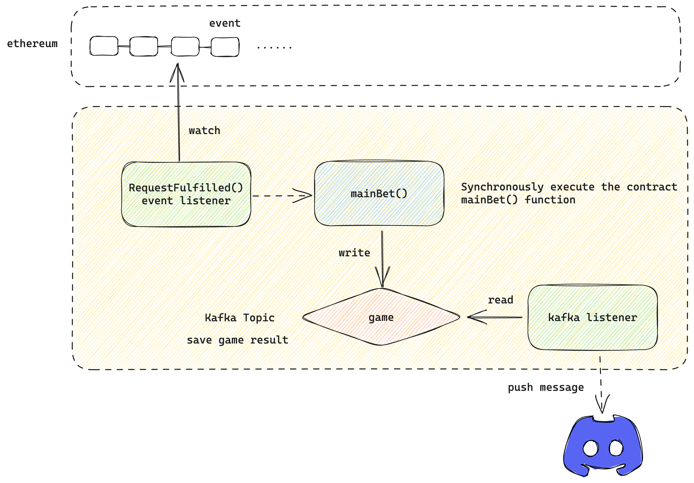

# gangbu-discord-bot

깐부: 类似 Squid 里的猜单双游戏

## demo

https://github.com/ISheepp/gangbu-discord-bot/assets/54968314/3c487648-26a2-44ee-a360-ad33c57bb692

## discord commands

+ /play : 进行游戏
+ /show : 展示当前用户的余额，充值地址
+ /history: 查看游戏历史记录
+ /withdraw : 提款 「输入address，amount」

## 步骤

1. 先展示用户信息来生成地址，然后往里面充值
2. 使用 /play 来进行游戏「输入您的选择和筹码」
3. 等待 bot 返回游戏结果

## 设计




### 合约

主要提供了两个public函数

1. requestRandomWords: 接收amount数量的ETH，调用Chainlink VRF合约的requestRandomWords函数申请随机数，生成完毕后由fulfillRandomWords函数完成回调。
2. mainBet: 根据玩家选择的odd/even和生成的随机数来比对，如果成功则向玩家发送两倍amount的ETH，失败则不进行操作，记录一次游戏的事件。

### 后端



提供gRPC方法供client端调用, server通过redis作为注册中心，kafka作为事件通知消息中间件，the graph作为查询游戏结果的去中心化索引器

主流程为：

1. 调用合约申请随机数函数
2. 监听VRF合约的生成随机数完成event，获取到requestId
3. 调用合约mainBet函数
4. 完成后将游戏结果推送至kafka topic
5. 由kafka reader来监听游戏历史topic，推送本次游戏完成信息到discord

### discord

从redis获取到gRPC server的地址，调用后端方法，通过接收对应的slash command来返回信息(InteractionResponseChannelMessageWithSource，也就是只返回给执行命令的人)

## 开发时遇到的问题

[如何由合约abi生成go文件](https://geth.ethereum.org/docs/developers/dapp-developer/native-bindings)

`abigen --abi abi.abi --pkg models --type EvenOddGame --out even_odd_game.go`

[参考 gorm 事务](https://blogs.halodoc.io/db-transactions-in-go/)

[kafka-go 连接问题](https://github.com/segmentio/kafka-go/issues/499)

## grpc相关

[protoc3语法](https://protobuf.dev/programming-guides/proto3/)

1. 在编写proto文件的时候，因为定义rpc必须要有参数和返回体，我们可以导入google事先定义好的一些包装类型
google/protobuf/wrappers.proto，空类型google/protobuf/empty.proto
2. 生成pb.go文件，其中game.pb.go文件包含了message的类型，game_grpc_pb.go包含了rpc方法的定义，服务端需要实现此方法，客户端使用其中的接口方法

## discord相关

discord slash command 只有3s的时间给后端响应

## the graph相关

the graph 无法索引合约状态变量，只能索引event

索引速度太慢了，块高度跟不上，也可能是因为还没有索引器

[参考](https://thegraph.com/blog/improve-subgraph-performance-reduce-eth-calls/)

## question

```bash
package gangbu/cmd
	imports gangbu/bot
	imports gangbu/bot/handler
	imports gangbu/pkg/util
	imports gangbu/game/listener
	imports gangbu/pkg/queue
	imports gangbu/pkg/util: import cycle not allowed
```

循环依赖报错
